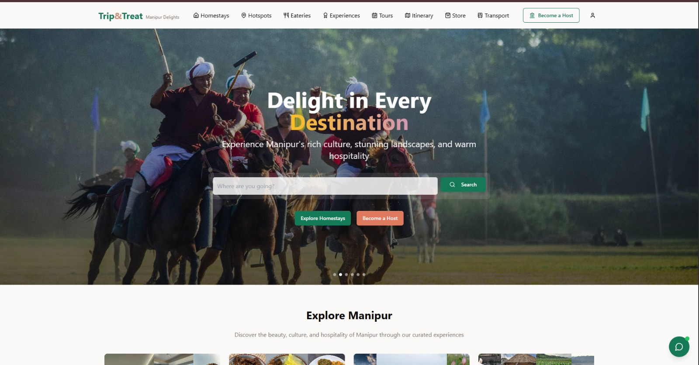

# Trip&Treat

> Discover homestays, experiences, and local attractions in Northeast India



[](https://opensource.org/licenses/MIT)
[](https://www.typescriptlang.org/)
[](https://reactjs.org/)
[](https://vitejs.dev/)
[](https://tailwindcss.com/)

## 🌟 Overview

Trip&Treat is a thoughtfully designed web application inspired by the Airbnb-style booking experience, offering a seamless way to discover and book homestays. What sets it apart is its unique twist — it not only showcases beautiful homestays but also integrates nearby tourist attractions and local eateries, helping travelers make the most of their stay.

Currently focused on Northeast India, especially Manipur, this platform is your gateway to exploring hidden gems, local delicacies, and cultural hotspots — all within reach of your chosen accommodation.

## ✨ Features

- 🏠 **Homestay Bookings** - Discover and book authentic homestays
- 🍽️ **Local Eateries** - Find and reserve tables at local restaurants
- 🎯 **Experiences** - Book unique local experiences and tours
- 🗺️ **Hotspots** - Explore tourist attractions and cultural sites
- 🚗 **Transport** - Arrange local transportation
- 🛍️ **Local Store** - Shop for local products and crafts
- 📱 **Responsive Design** - Works seamlessly on all devices
- 🔐 **User Authentication** - Secure login and profile management
- 👨‍💼 **Host Dashboard** - Tools for property owners
- 🛡️ **Admin Panel** - Comprehensive admin controls

## 🚀 Tech Stack

- **Frontend**: React 18, TypeScript, Vite
- **UI Library**: Radix UI, Tailwind CSS, Shadcn/ui
- **Backend**: Supabase (PostgreSQL, Auth, Storage)
- **State Management**: React Query (TanStack Query)
- **Forms**: React Hook Form with Zod validation
- **Routing**: React Router DOM
- **Icons**: Lucide React
- **Animations**: Framer Motion

## 📋 Prerequisites

Before you begin, ensure you have the following installed:

- Node.js (v18 or higher)
- npm or yarn or bun
- Git

## 🛠️ Installation

1. **Clone the repository**

   ```bash
   git clone https://github.com/your-username/trip-treat.git
   cd trip-treat
   ```

2. **Install dependencies**

   ```bash
   npm install
   # or
   yarn install
   # or
   bun install
   ```

3. **Set up environment variables**

   ```bash
   cp .env.example .env.local
   ```

   Fill in your environment variables in `.env.local`:

   ```env
   VITE_SUPABASE_URL=your_supabase_url_here
   VITE_SUPABASE_ANON_KEY=your_supabase_anon_key_here
   VITE_APP_NAME=Trip&Treat
   VITE_APP_VERSION=1.0.0
   ```

4. **Set up Supabase Database**
   - Create a new project at [supabase.com](https://supabase.com)
   - Follow the detailed [Database Setup Guide](DATABASE_SETUP.md)
   - Or run the quick setup: `node scripts/setup-database.js`

5. **Configure AI Features (Optional)**
   - **For Contributors**: AI features are **disabled by default** - no API keys needed!
   - **For Production**: Set `ENABLE_AI_FEATURES=true` and add API keys to enable AI-powered itinerary generation
   - See [AI Features Setup](#ai-features-setup) section below for details

6. **Start the development server**

   ```bash
   npm run dev
   # or
   yarn dev
   # or
   bun dev
   ```

   Open [http://localhost:8080](http://localhost:8080) to view it in the browser.

## 🏗️ Project Structure

```
src/
├── components/          # Reusable UI components
│   ├── ui/             # Shadcn/ui components
│   └── ...             # Custom components
├── contexts/           # React contexts (Auth, etc.)
├── hooks/              # Custom React hooks
├── integrations/       # External service integrations
│   └── supabase/       # Supabase client and types
├── pages/              # Page components
├── utils/              # Utility functions
└── lib/                # Library configurations
```

## 🤖 AI Features Setup

### **For Contributors (Recommended)**

AI features are **disabled by default** to ensure contributors can work without API costs:

```env
# In your .env.local file
ENABLE_AI_FEATURES=false
```

This will use **sample itineraries** instead of AI-generated ones, allowing you to:

- ✅ Work without any API keys
- ✅ Test all functionality
- ✅ Contribute without costs
- ✅ See realistic sample data

### **For Production (Optional)**

To enable AI-powered itinerary generation:

1. **Get API Keys**:
   - [OpenAI API Key](https://platform.openai.com/api-keys) (for GPT-4o-mini)
   - [Google Custom Search API](https://developers.google.com/custom-search/v1/introduction) (for real-time data)

2. **Update Environment Variables**:

   ```env
   ENABLE_AI_FEATURES=true
   OPENAI_API_KEY=your_openai_api_key_here
   GOOGLE_API_KEY=your_google_api_key_here
   GOOGLE_CSE_ID=your_google_cse_id_here
   ```

3. **Deploy to Supabase**:
   ```bash
   # Deploy the function with environment variables
   supabase functions deploy generate-itinerary
   ```

### **Cost Information**

- **OpenAI GPT-4o-mini**: ~$0.15 per 1M input tokens, ~$0.60 per 1M output tokens
- **Google Custom Search**: $5 per 1,000 queries (first 100 queries/day free)
- **Estimated cost per itinerary**: $0.01-0.05

## 🧪 Testing

```bash
# Run tests
npm run test

# Run tests in watch mode
npm run test:watch

# Run tests with coverage
npm run test:coverage
```

## 🤝 Contributing

We welcome contributions! Please see our [Contributing Guidelines](CONTRIBUTING.md) for details.

### Development Workflow

1. Fork the repository
2. Create a feature branch: `git checkout -b feature/amazing-feature`
3. Make your changes
4. Run tests: `npm run test`
5. Run linting: `npm run lint`
6. Commit your changes: `git commit -m 'Add amazing feature'`
7. Push to the branch: `git push origin feature/amazing-feature`
8. Open a Pull Request

## 📝 Available Scripts

- `npm run dev` - Start development server
- `npm run build` - Build for production
- `npm run preview` - Preview production build
- `npm run lint` - Run ESLint
- `npm run test` - Run tests
- `npm run test:watch` - Run tests in watch mode
- `npm run test:coverage` - Run tests with coverage

## 📚 Documentation

- [Contributing Guidelines](CONTRIBUTING.md)
- [Database Setup Guide](DATABASE_SETUP.md)
- [Contributor Checklist](CONTRIBUTOR_CHECKLIST.md)
- [AI Features Documentation](AI_FEATURES.md)

## 🐛 Bug Reports

If you find a bug, please open an issue with:

- A clear description of the problem
- Steps to reproduce
- Expected vs actual behavior
- Screenshots if applicable

## 💡 Feature Requests

We'd love to hear your ideas! Please open an issue with the "enhancement" label.

## 📄 License

This project is licensed under the MIT License - see the [LICENSE](LICENSE) file for details.

## Acknowledgments

- [Supabase](https://supabase.com) for the backend infrastructure
- [Shadcn/ui](https://ui.shadcn.com) for the beautiful UI components
- [Vite](https://vitejs.dev) for the fast build tool
- [Tailwind CSS](https://tailwindcss.com) for the utility-first CSS framework
